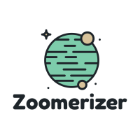

# Zoomerizer

<p align="center">
  
</p>

## Introduction

This is a full stack javascript based web application to showcase the capabilities of the [AssemblyAI API](https://docs.assemblyai.com/overview/getting-started) by transcribing Zoom meeting recordings.

A user can create an account, upload their MP3 recording, and download a pdf with the audio transcription, along with key words in the recording. There is a hard cap of 5 minute audio recordings only to not exceed the API cap.

If you would like to follow along building the backend of this application, I wrote an article on dev.to here:

## Demo

Live site: https://zoom-summarizer.vercel.app/

## Technologies

- Backend
  - Node.js
  - PostgreSQL
  - Express
  - Prisma ORM
  - Bcrypt
  - JWT
  - pdfkit
- Frontend
  - Next.js
  - Tailwind CSS
- Deployment
  - Netlify (Frontend) & Heroku (Backend)

## Run Locally

##### Frontend

1. Install dependencies

```
$ npm i
```

2. set .env according to env_sample.txt

3. Run frontend

```
$ npm run dev
```

##### Backend

1. Install dependencies

```
$ npm i
```

2. Run Prisma migration to create tables

```
$ npx prisma migrate reset
```

3. Create an AWS S3 bucket and make sure you have your security credentials ready for your cli: https://cloudacademy.com/blog/how-to-use-aws-cli/

4. Run backend

```
$ npm run dev
```
